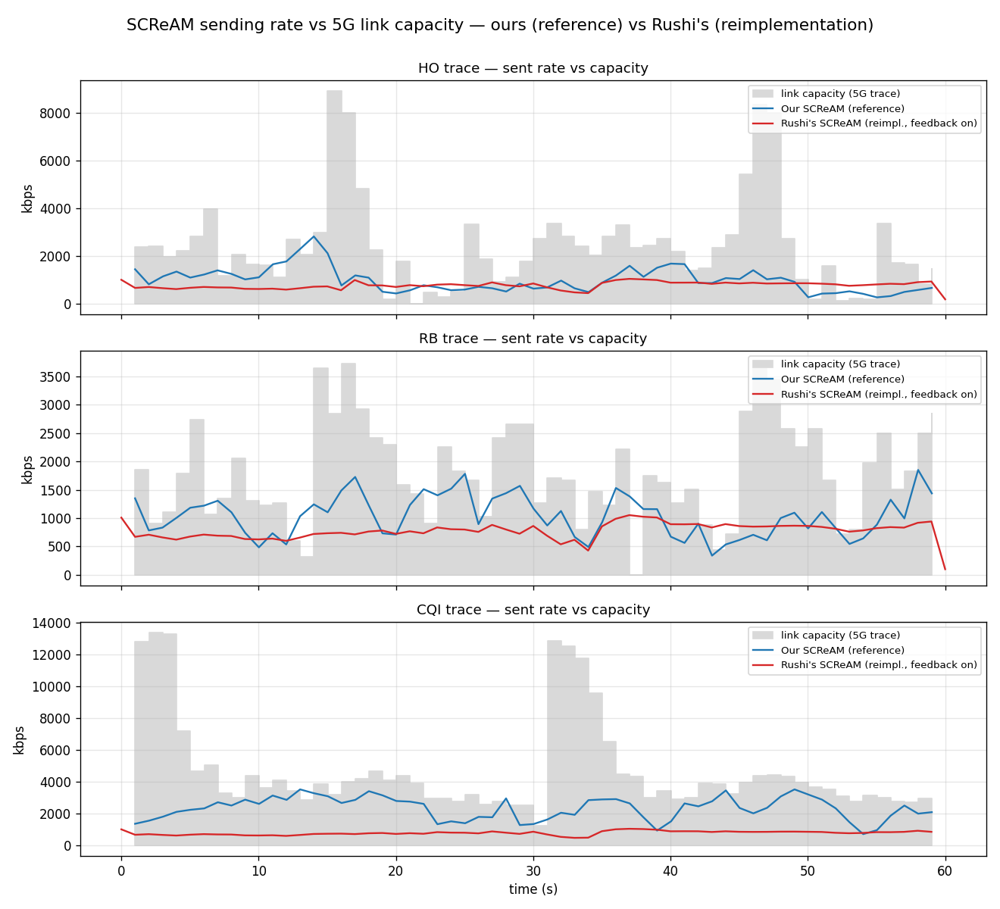
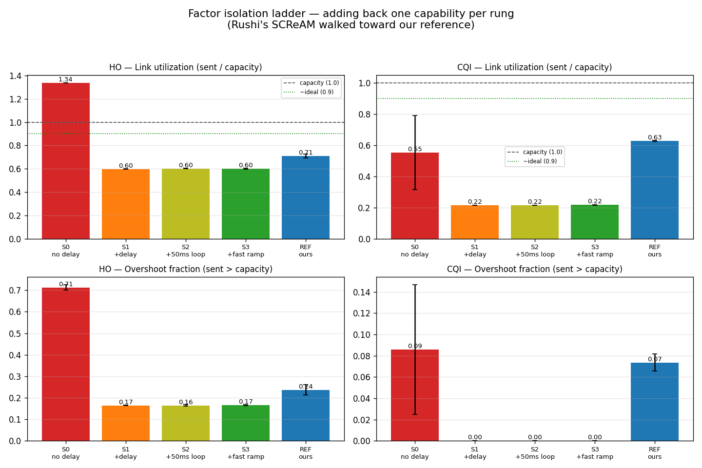

# SCReAM Head-to-Head: Our Implementation vs Rushi's (UMN)
## With factor isolation — what actually causes the difference

**Date:** 2026-05-28
**Question:** When the network gets congested, whose SCReAM controls the
video stream better — ours, or Rushi's (UMN Teleop-Gopher-streamer) — and
*which specific factors* cause the difference?

---

## The short answer

**With both controllers configured fairly, ours uses the network better.**

- Ours keeps its sending rate tracking the link's available bandwidth
  (uses ~63–71% of it).
- Rushi's parks at a roughly **constant ~780 kbps no matter how much
  bandwidth is available** — so on a good link (4.7 Mbps) it uses only
  ~22% and wastes the rest.
- Neither floods the link once Rushi's is configured correctly.

**But the cause is not the SCReAM algorithm — it's an implementation
gap.** Rushi's controller *decides* on a sending rate correctly, but that
decision doesn't reach the encoder, so the actual rate stays pinned near
780 kbps regardless. We proved this by isolating each factor (below).

> **Important correction.** An earlier version of this report concluded
> "ours floods the link less." That was wrong — it was caused by a
> configuration mistake on our side (we ran Rushi's SCReAM without its
> `network_time_sync` flag, which disables its main congestion signal).
> After fixing that, Rushi's no longer floods. The corrected, isolated
> findings are below.

---

## What we compared

Both systems use the same congestion-control idea, **SCReAM** — the part
of a video streamer that decides *how fast to send* so it doesn't
overflow the network. They are different implementations of it:

| | Our SCReAM | Rushi's SCReAM |
|---|---|---|
| Origin | Ericsson's official SCReAM (the reference) | UMN's own re-write in Python |
| Built into | GStreamer (`gstscream` plugin) | Teleop-Gopher-streamer (PyAV) |
| Re-checks the network | continuously | every 200 ms |
| Congestion signals | delay + loss (both) | delay only (loss path present but not firing) |

The Python re-write describes itself in its own code as
"SCReAM-*inspired*… intentionally conservative for the first hardware
integration," with receiver feedback planned for "the next phase." So it
is an early re-implementation, not the full reference algorithm — which
turns out to matter.

---

## The setup (as simple as possible)

Everything ran on **one machine** (lab box "aum"). The video sender and
receiver are two programs on that machine talking over the local
loopback (`127.0.0.1`). No Wi-Fi, no cabling, no second computer.

```
   ┌─────────────────────────────────────────────┐
   │  one machine                                │
   │   SENDER ───────────────────▶ RECEIVER      │
   │   (reads video, runs SCReAM)  (decodes)     │
   │                     ▲                       │
   │          ┌──────────┴──────────┐            │
   │          │ artificial network  │            │
   │          │ bottleneck (Linux   │            │
   │          │ "tc" on loopback),  │            │
   │          │ capacity changes    │            │
   │          │ over time per a 5G  │            │
   │          │ recording ("trace") │            │
   │          └─────────────────────┘            │
   └─────────────────────────────────────────────┘
```

The **same** bottleneck was applied to both systems, so any difference is
the controller, not the test.

### The video (the workload)

The same real camera clip in every run:

| | |
|---|---|
| File | `realmotion.avi` (the clip you provided) |
| Picture | 1280 × 1024, 10 frames/sec |
| Length | 60 s (600 frames), Motion-JPEG, ~5.6 Mbps original |

Both systems read this same file and re-compressed it as VP8 to send.

### The traces (network conditions)

A "trace" is a 30-second recording of how a real 5G connection's
bandwidth rose and fell, replayed to drive the bottleneck (scaled to
~1/3 so the link is actually tight for this clip).

| Trace | Real-world meaning | Bandwidth behavior |
|---|---|---|
| **HO** | a **handover** between cell towers | sharp cliffs to near-zero, then recovery |
| **RB** | **resource-block** sharing with other users | bumpy, moderate swings |
| **CQI** | **channel-quality** drift | gentle, slow waves, high average |

### How we measured "good"

For a congestion controller, "good" = send as much as the link can carry
*without going over*. So the two fair, identical-for-both numbers are:

1. **Bandwidth used** = sent rate ÷ available bandwidth. Higher is better,
   but over 100% is bad (sending more than the link can carry).
2. **Overshoot** = fraction of time sending *more* than the link allows.
   Lower is better.

We do **not** rank by "frames delivered": Rushi's receiver tries to show
even broken, half-received frames, so it always reports 100% delivered no
matter how corrupt — that number can't tell good from bad.

---

## Results (both configured fairly)

Averaged over 3 repeats per trace:

| Network | System | Bandwidth used | Overshoot | Sent rate |
|---|---|---|---|---|
| **HO** | Ours | 71% | 0.24 | tracks (≈1020 kbps) |
| | Rushi's | 60% | 0.17 | ≈776 kbps |
| **RB** | Ours | 68% | 0.11 | tracks (≈1040) |
| | Rushi's | 56% | 0.12 | ≈776 |
| **CQI** | Ours | **63%** | 0.07 | tracks (≈2339) |
| | Rushi's | **22%** | 0.00 | ≈780 |

The tell-tale sign: **Rushi's sends ≈776–782 kbps on all three traces**,
even though their capacities differ 2.5× (1825 vs 2387 vs 4710 kbps). Its
rate is decoupled from the network. Ours moves its rate with the
available bandwidth (1040 → 1020 → 2339).

So on the easy, high-bandwidth link (CQI) ours uses ~3× more of the
available capacity. On the hard, cliffy link (HO) they're close — Rushi's
even overshoots slightly less, because parking low is "safe."



---

## Factor isolation — what causes the difference

We started from Rushi's SCReAM in its weakest state and added back one
capability at a time, measuring after each. The change at each step =
that factor's contribution.



| Rung | What changed | HO overshoot | CQI bandwidth used |
|---|---|---|---|
| **S0** | delay signal OFF (our original mistake) | **0.71** (floods) | 0.55 |
| **S1** | **+ delay signal** (`network_time_sync` on) | **0.17** | 0.22 |
| **S2** | + faster loop (200 ms → 50 ms) | 0.16 | 0.22 |
| **S3** | + faster ramp-up | 0.17 | 0.22 |
| **REF** | our reference SCReAM | 0.24 | **0.63** |

What each rung tells us:

1. **The delay signal is the whole flooding story (S0 → S1).** Turning on
   Rushi's congestion signal drops overshoot from 0.71 to 0.17 — it stops
   flooding entirely. SCReAM is a *delay-based* controller; without the
   delay signal it was blind. (This was our config mistake, now fixed.)

2. **Loop speed and ramp rate do NOT matter (S1 → S2 → S3).** Making the
   control loop 4× faster (50 ms) and the ramp-up more aggressive changed
   nothing — bandwidth used stayed flat at 22% on CQI. So the
   under-utilization is **not** a timing problem. This rules out a factor
   we suspected. (Useful negative result.)

3. **The remaining gap is an implementation gap, not the algorithm
   (S3 → REF).** With timing ruled out, the only thing left explaining
   Rushi's flat ~780 kbps is that its controller's *decision doesn't reach
   the encoder*. We confirmed this directly: in 89% of control decisions,
   the actual sent rate was more than 1.3× what the controller commanded —
   the controller asked for ~200–290 kbps, the encoder sent ~780 anyway.
   The controller is not actually in control of the rate.

4. **A second implementation gap:** Rushi's loss signal never fired
   (`receiver_loss > 0` in 0 of 132 decisions, even on a lossy link). So
   it runs on the delay signal alone — real SCReAM uses delay *and* loss.

### The attribution, in one paragraph

Rushi's SCReAM under-performs ours for two reasons, and **neither is the
SCReAM algorithm or its tuning**: (1) it shipped with its delay signal
off by default in our first test — a config issue, now corrected, that
was responsible for all the apparent "flooding"; and (2) once corrected,
its controller's rate decisions don't reach the encoder (an
implementation gap), so its sending rate is pinned near 780 kbps and
can't rise to use a fast link. Loop interval and ramp tuning were tested
and shown to make no difference. The loss half of its congestion signal is
also not wired up. **Our reference SCReAM wins on link utilization because
its controller actually drives the encoder rate; the gap is in plumbing,
not in the control algorithm.**

---

## What this does and doesn't prove

**Shows, repeatably:** once both are fairly configured, ours tracks
available bandwidth and Rushi's does not (it parks at ~780 kbps); the
cause is an implementation gap (controller→encoder), not the algorithm or
its timing.

**Does not show:** a final video-quality number (PSNR/SSIM). We measured
network behavior, not delivered picture quality. That's the natural next
step for a hard quality comparison.

**Other limits:**

- One machine over loopback — bandwidth/delay faithfully reproduced, but
  not real 5G radio effects.
- Both given matching bitrate bounds (0.2–4 Mbps); they are different
  programs with different internal knobs, compared as configured.
- Rushi's controller is an early re-implementation (its own code says
  receiver feedback is a future phase) — this is a fair snapshot of the
  current branch, not a statement about SCReAM-the-algorithm.

---

## How to reproduce

On `aum`, from `~/GstreamerExp`:

```sh
# main 2-arm sweep (ours vs Rushi's, 3 traces x 3 reps)
bash tools/comparison_sweep.sh 3
# fair re-run of Rushi's with the delay signal on
bash tools/umn_scream_rerun.sh 3
# isolation ladder rungs
bash tools/umn_ladder.sh s2 50 1.05 3      # faster loop
bash tools/umn_ladder.sh s3 50 1.15 3      # + faster ramp
# numbers, diagnostics, charts
.venv/bin/python tools/extract_comparison.py
.venv/bin/python tools/diag_umn.py ~/comparison-runs/umn-scream-v2/cqi/rep1
.venv/bin/python tools/plot_ladder.py
.venv/bin/python tools/plot_comparison.py
```

- Our arms: configs `90` (SCReAM) / `91` (GCC) — loopback, real clip.
- Rushi's arm: `teleop-gopher-streamer-build`, `congestion_controller: scream`,
  **`network_time_sync: true`** (the flag that matters).
- Bottleneck: `tools/tc_lo_driver.py` fed
  `specs/networks/mahimahi-5g-{ho,rb,cqi}-100ms-x0p33.yaml`.

Raw numbers: [metrics.csv](metrics.csv).
